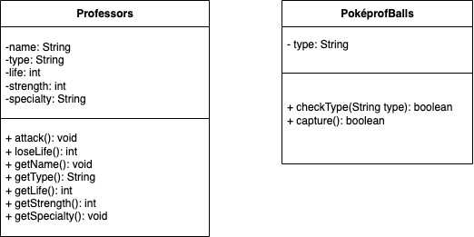

# Meeting 1
Time: 7 March 2022, 14:00-17:00.
Participants: Joris LEFONDEUR, Pol KIHN, Yinghan LING
Location: Luxembourg Learning Center GW 2.14

## Preparation
We created an organization on Github and added all the teammates and Prof. Müller to the organization.

## Brainstorming on Project Design
- Joris: an escape game where the player can solve puzzles by asking the questions about the department. 
- Yinghan: a combat game where the user fights against the enemies, with the power given by different departments of the Faculty of Science, Technology and Medicine (FSTM).
- Pol: a Pokémon game university version where the player catches professors or teachers from FSTM with Pokémon balls and thus gains corresponding power.

## Draft Project: Poképrof
The planet of FSTM is under crisis. The villain took our dean away and he attacks us with his army. In order to defeat the villain and save the dean, we need to gather five keys in the rooms of Mathematics, Physics, Engineering, Computer Science, Life Sciences and Medicine. To get these keys, we need to meet the challenges and solve the problems in the five rooms. The challenges could include solving puzzles, escaping the room that is locked up by a bunch of hackers and fighting against the aliens. There are staff, namely the Poképrof, living in their corresponding rooms that we can capture with Poképrof balls. We can solve the problems with the Poképroves' superpower. When we have all the five keys, we can unlock the sixth room where the final villain is located. Once we defeat the villain, the dean will be freed. 

## Program Design From Developers' Viewpoint
The classes of this game contains Professors, PoképrofBalls, Rooms, etc.

## Feasibility
- Scope of the game: This game is run on the mobile phones with Android system.
- Technically speaking, it is feasible because this game can be pretty object oriented. Since our team is trained mostly with Java, it will easier to find and learn a programming language that can make this game come to live.
- Benefits of this project: From the client's point of view, this game is interesting to play because it transfers boring and long description of FSTM into game characters. Through playing this game, the user will have a better knowledge on FSTM.
- Risks: The time we have may be too short to realize a project this big. Besides, the programmers may not be able to acquire relevant knowledge to make certain functionalities. In these cases, we probably need to reduce the smaller number of rooms and Poképroves.

## Inspiration
Prepare a todo list for next discussion so the conversation will be more efficient.